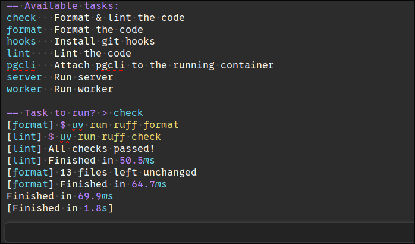

# Mise build system for Sublime Text

A Sublime Text build system that integrates with [mise](https://mise.jdx.dev/) to run tasks defined in your Mise configuration.

## What this does

### Build system

This is a **build system for the mise task runner** — it is NOT for managing environments or tool installations. When using the provided build system it will:

- List available tasks
- Interactively prompt you for a task to run
- Execute that task and how syntax-highlighted output in Sublime Text's build output panel

### Command

Another way of interacting with Mise is through the "Run Mise task" command, available in the Command Palette. This will fetch the available tasks defined in your project and give you a menu to select from. The selected task will be ran.

In order to find the directory from which to run Mise, the preference is:
1. The current open file's directory.
2. The first directory you have in the sidebar/project.
3. Your `$HOME` directory.

## Installation

### Package Control

1. Open the Command Palette (`Ctrl+Shift+P` or `Cmd+Shift+P`)
2. Search for "Package Control: Install Package"
3. Search for "Mise" and install

### Manual

Put this repository inside your Sublime Text Packages folder.

## Usage

1. Open a file in your project (must be within a directory containing `mise.toml` or `mise.local.toml`)
2. Select `Tools > Build System > Mise` (or let Sublime auto-detect it)
3. When prompted, type the name of the task you want to run and press Enter

## Requirements

- [mise](https://mise.jdx.dev/) must be in Sublime's `PATH`

## Limitations and future work

- It hasn't been tested on Windows. Let me know if it works or not so I can fix it/remove this line.
- Doesn't support all the [config file paths Mise supports](https://mise.jdx.dev/configuration.html#mise-toml). That means if you store your mise config in e.g. `mise/config.toml`, Sublime won't offer you Mise as an option. You can still force-select it.
- Planned features (read: will likely never bother, feel free to open a PR)
	- Better syntax highlighting of the results.
	- A "Mise Exec" build system that prompts the user for any command and does `mise exec -- $input`
