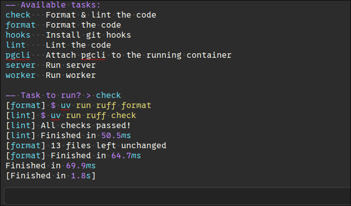

# Mise integration for Sublime Text

A Sublime Text package that integrates with [mise](https://mise.jdx.dev/).



## What this does

### Environment loading

This package will load the environment variables that Mise provides when you open a project and clean up after itself after changing.

This feature looks through the folders configured in your sublime-project file, trying to find any that have a `mise.toml` or `mise.local.toml` in its root.

The package will load environments from the shorter path it can, meaning if you add two directories to your project, `root` and `root/server`:
```
root
├── mise.toml
└── server
    └── mise.toml
```

Only root's env will be loaded. If root doesn't have a mise.toml, then the subdirectory's mise.toml will be used.
```
root
└── server
    └── mise.toml
```

This was done to simplify things but may change in the future.

### Build system

The package provides a build system for the mise task runner. When using the provided build system it will:

- List available tasks
- Interactively prompt you for a task to run
- Execute that task and how syntax-highlighted output in Sublime Text's build output panel

### Commands

Another way of interacting with Mise is through the "Mise: Run task" command, available in the Command Palette. This will fetch the available tasks defined in your project and give you a menu to select from. The selected task will be ran.

There is also a command to execute `mise trust` from the editor. It is available in the Command Palette as "Mise: Trust config".

In order to find the directory from which to run Mise for a command, the preference is:
1. The directory of the currently-open file.
2. The first directory you have in the sidebar/project.
3. Your `$HOME` directory.

## Installation

### Package Control

1. Open the Command Palette (`Ctrl+Shift+P` or `Cmd+Shift+P`)
2. Search for "Package Control: Install Package"
3. Search for "Mise" and install

### Manual

Put this repository inside your Sublime Text Packages folder.

## Requirements

- [mise](https://mise.jdx.dev/) must be in Sublime's `PATH`

## Limitations and future work

- It hasn't been tested on Windows. Let me know if it works or not so I can fix it/remove this line.
- Doesn't support all the [config file paths Mise supports](https://mise.jdx.dev/configuration.html#mise-toml). That means if you store your mise config in e.g. `mise/config.toml`, Sublime won't automatically offer you Mise as an option for building. Environment loading also won't work.
- Planned features (read: will likely never bother, feel free to open a PR)
	- Load global Mise environment on plugin load (configurable via setting)
	- Better syntax highlighting of the results.
	- A "Mise Exec" build system that prompts the user for any command and does `mise exec -- $input`
